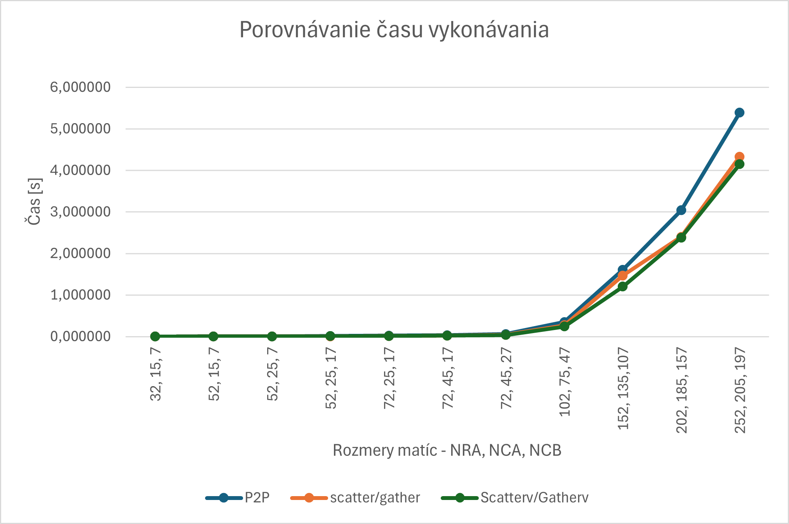

# Dokumentácia k zadaniu číslo 3
Cieľom tohto zadania bolo modifikovať program **násobenia matíc**
nasledovne:
1. Umožnite program vykonávať **ľubovoľnému počtu pracovných uzlov**.
To znamená, že počet riadkov matice A nebude musieť byť deliteľný
bezo zvyšku počtom uzlov výpočtu.
2. Na distribúciu podmatíc A_i jednotlivým uzlom a poskladanie výslednej
matice C nepoužívajte P2P komunikáciu, ale **metódy kolektívnej komunikácie
scatter()/gather()**.

## Popis implementácie
Využila som implementáciu **cv.mat_parsg.py** zo seminára číslo 7. 
Modifikovať bolo potrebné rozdelenie matice A. Ak počet pracovných uzlov
delí počet riadkov matice A bezo zvyšku, každý uzol dostane rovnako veľkú
podmaticu matice A. Ak je zvyšok po delení väčší ako 0, toľko pracovných
uzlov bude mať podmaticu o 1 riadok väčšiu. Toto rozdelenie realizuje 
funkcia **initialise_matrix_a(extra_rows, total_rows, nproc, rows_per_proc)**.
Podmatice sú ukladané do poľa a následne odoslané všetkým pracovným 
uzlom pomocou funkcie **scatter()**. Po vykonaní operácie násobenia sú 
zas zhromadžené v uzle **MASTER** pomocou funkcie **gather()**.

## Experimenty
Úlohou zadania bolo aj vykonanie experimentov porovnania implementácií
s P2P kominukáciou a s metódami kolektívnej komunikácie scatter()/gather().
Experimenty som vykonala s 3 pracovnými uzlami, preto som si upravila aj 
implementáciu s P2P komunikáciu, ktorá sa nachádza v súbore **p2p.py**.
Postupne som zväčšovala rozmery matíc A a B. Pre jednu kombináciu 
rozmerov som program spustila 100-krát a vypočítala priemerný čas behu.
Priemerné časy pre jednotlivé rozmery matíc sú zaznamenané v 
nasledujúcej tabuľke a znázornené na nasledujúcom grafe.

| Rozmery matíc (NRA, NCA, NCB) | Čas - scatter()/gather() | Čas - P2P |
|-------------------------------|--------------------------|-----------|
| (32, 15, 7)                   | 0,003802                 | 0,004856  |
| (52, 15, 7)                   | 0,004444                 | 0,007886  |
| (52, 25, 7)                   | 0,010033                 | 0,012299  |
| (52, 25, 17)                  | 0,018706                 | 0,024193  |
| (72, 25, 17)                  | 0,029019                 | 0,035508  |
| (72, 45, 17)                  | 0,045822                 | 0,058678  |
| (72, 45, 27)                  | 0,069702                 | 0,091644  |
| (102, 75, 47)                 | 0,270959                 | 0,332301  |
| (152, 135,107)                | 1,520105                 | 1,891139  |
| (202, 185, 157)               | 4,047501                 | 4,900213  |
| (252, 205, 197)               | 7,198857                 | 8,422103  |

Ako môžeme vidieť či už v tabuľke alebo na grafe, čas behu programu s 
použitím funkcií scatter()/gather() je kratší ako čas behu programu s P2P
komunikáciou pre všetky veľkosti matíc. Pri menších rozmeroch je rozdiel
minimálny a postupne sa zväčšuje spolu so zväčšujúcimi sa rozmermi matíc.
Pri rozmeroch matice A 252x205 a matice B 205x197 rozdiel časov presiahol
1 sekundu.

## Zdroje
- zdrojové súbory zo seminára číslo 7 dostupné na: 
https://elearn.elf.stuba.sk/moodle/mod/folder/view.php?id=27376