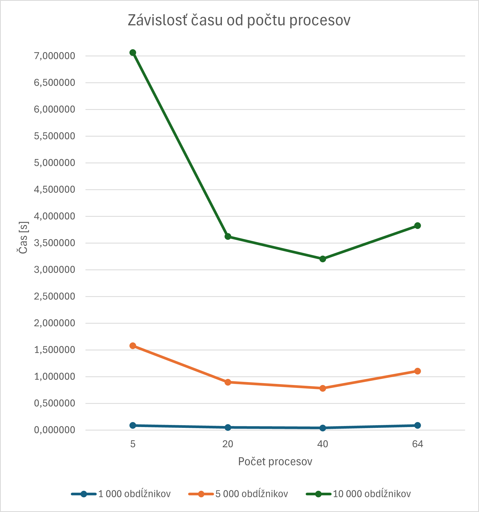

# Dokumentácia k semestrálnemu zadaniu

Úlohou semestrálneho zadania je navrhnúť a implementovať 
**paralelný algoritmus**, ktorý na základe výstupu
z lodného počítača vypočíta **plochu** úrody, ktorá bude
lúčom vyzbieraná. Na implementáciu paralelizácie bola
zvolená knižnica **MPI**. Súčasťou zadania je aj vykonanie
**experimentov** závislosti času od počtu uzlov.

## Popis implementácie
Na reprezentáciu začiatočných a koncových hrán obdĺžnikov 
som si vytvorila triedu **Event**, ktorá má 3 nasledujúce 
atribúty:
- **x** - reprezentuje **x-ovú súradnicu** danej hrany,
- **is_start** - označuje, či je daná hrana začiatočná
alebo nie,
- **y_range** - reprezentuje y-rozsah obdĺžnika.

Uzol, ktorého **rank** je rovný **MASTER**, zabezpečí 
spracovanie vstupu do triedy **Event** a rozdistribuovanie 
všetkých potrebných dát medzi ostatné uzly. Všetky 
**Eventy** a **offsety** sú rozposlané **MASTROM** pomocou 
funkcie **bcast()** a polia aktuálnych obdĺžnikov pre 
zodpovedajúce Eventy sú rozposlané pomocou funkcie 
**scatter()**. Následne všetky uzly začnú vypočítavať 
pokrytú plochu medzi pre nich špecifikovanými eventmi. Na 
záver všetky medzivýpočty sčíta **MASTER** a výsledok vypíše.

## Experimenty
Na implementácii som vykonala experimenty, ktoré sledujú
závislosť **času** behu programu od **počtu** uzlov. 
Tieto experimenty som vykonala na **3** rôznych vstupných 
súboroch, ktoré obsahovali rozdielne počty obdĺžnikov. 
V tomto repozitári sa nachádzajú aj jednotlivé vstupné 
testovacie súbory a testovací kód v súbore **main_test.py**.
Experimenty boli vykonané na počítači **Devana** pre 
**5, 20, 40 a 64** uzlov. Každé meranie som opakovala 
**100-krát**, odstránila som prvé 2 merania a následne 
som vypočítala aritmetický priemer. V nasledujúcej tabuľke 
sú uvedené jednotlivé hodnoty pre príslušné merania 
a na grafe sú znázornené závislosti.

| Názov súboru     | Počet obdĺžnikov | Čas - 5 uzlov | Čas - 20 uzlov | Čas - 40 uzlov | Čas - 64 uzlov |
|------------------|------------------|---------------|----------------|----------------|----------------|
| rectangles8.txt  | 1 000            | 0,0865766     | 0,0482880      | 0,0410111      | 0,0871039      |
| rectangles9.txt  | 5 000            | 1,5763421     | 0,8960923      | 0,7828134      | 1,1046632      |
| rectangles10.txt | 10 000           | 7,0674243     | 3,6218720      | 3,2040077      | 3,8259710      |

Ako môžeme vidieť, či už v tabuľke alebo na grafe, 
**čas** behu programu **klesá** s **narastajúcim** 
počtom **uzlov** až do momentu, keď **obsluha** 
uzlov nezačne byť časovo náročnejšia ako samotný 
výpočet. **Najkratšie** časy boli dosiahnuté pri 
počte uzlov medzi **20 a 40**. Pri **väčších** 
vstupoch je čas behu programu **vyšší** a zároveň
**najkratšie** časy sú dosahované **bližšie** k 40 uzlom.

## Zdroje
- algoritmus **sweep line**, dostupný na:
https://www.youtube.com/watch?v=9wy6OA3Yvpg
- prezentácia z prednášky číslo 12, dostupná na:
https://elearn.elf.stuba.sk/moodle/pluginfile.php/77449/mod_resource/content/1/Prednaska_12.pdf